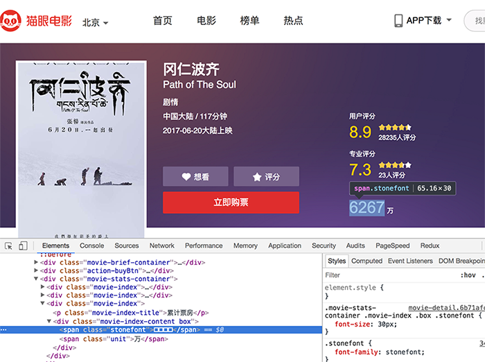
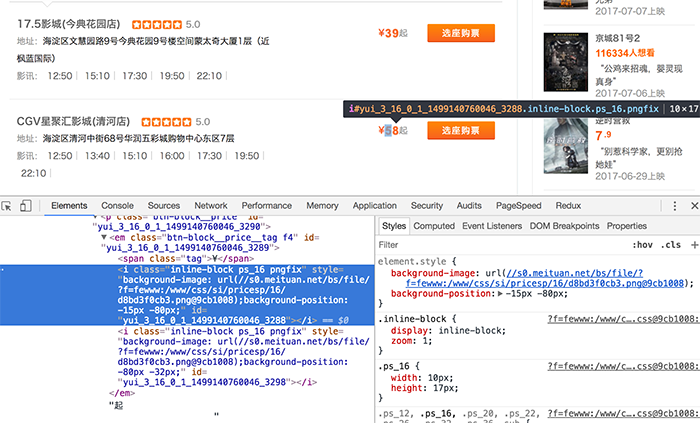
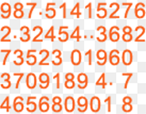
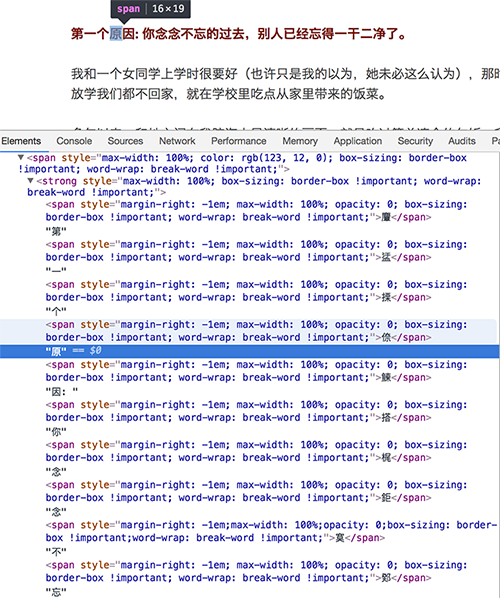
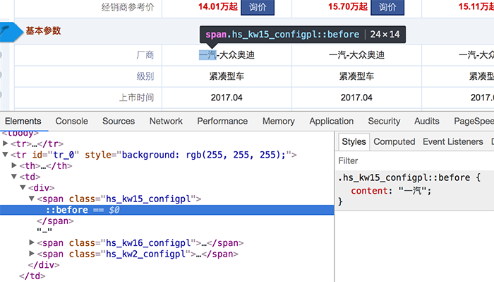
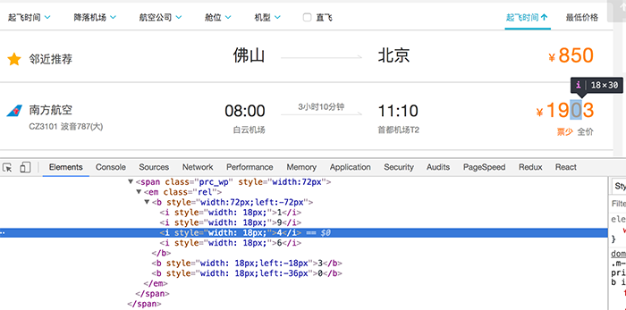
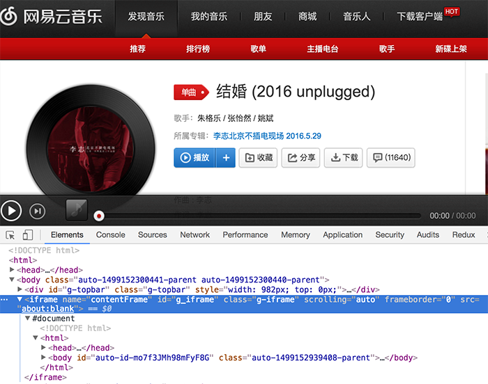
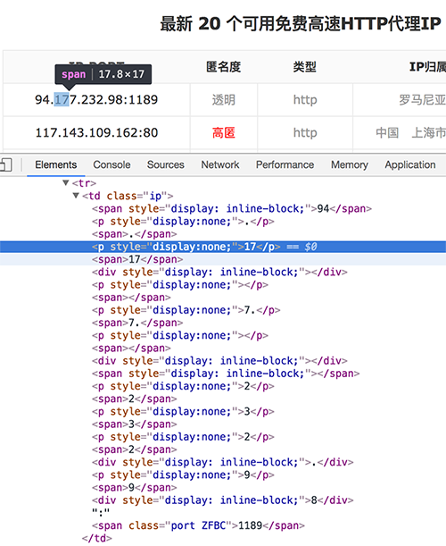
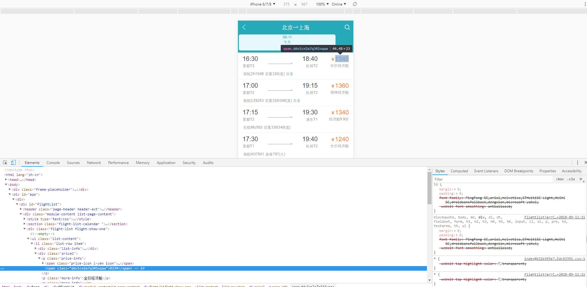

## 
常用反爬策略

### 前言  
对于一张网页，我们往往希望它是结构良好，内容清晰，尽量直观的展示，才能让搜索引擎准确的认知他。而反过来，有些情景下，我们并不希望网页内容被轻易获取，比如电商网站的交易额，教育网站的题目及一些信息量较为重要的站点比如企信网，因为这些内容，往往是一个产品的生命线，必须做到有效保护。爬虫与反爬之间的博弈由此开始。

### 常见反爬策略  
首先，反爬是相对的，世界上没有一个网站，能做到完美的反爬。  
如果页面希望能在用户面前正常展示，同时又不给爬虫机会，就必须要做到识别真人和机器。因此码农们做了各种尝试，这些策略大多数采用于后端，也是目前比较常规简单有效的手段，比如:
+ User-Agent+Referer检测
+ 账号及Cookie验证
+ 验证码
+ IP限制频次
+ 数据干扰
+ 参数加密(企信网)  
而爬虫是可以无限逼近于真人的，比如：
+ chrome headless或者phantomjs来模拟浏览器环境
+ tesseract识别验证码
+ 代理ip等  
所以说，100%能反爬是不可能的，只能逐步提升爬虫爬取数据的门槛。
### 一些大厂的反爬做法  
+ font-face拼凑式  
例子：[猫眼电影](http://maoyan.com/films/342601)  
猫眼电影里，对于票房数据，展示的并不是纯粹的述职。页面使用font-face定义了字符集，并通过unicode去映射展示。也就是说，出去图像识别，必须同时爬取字符集，才能识别出数字。  
,  
并且，每次刷新页面，字符集的URL都是有变化的，无疑更大难度的增加了爬取成本  
  

+ background拼凑式  
例子：[美团](http://www.meituan.com/dianying/342601?#content)  
与font的策略类似，美团里用到的是background拼凑，数字其实是图片，根据不同的background便宜，显示出不同的支付。  
  
并且不同页面，图片的字符排序也是有区别的。不过理论上只需要生成0-9与小数点。  
页面A：  页面B：  

+ 字符穿插式  
例子：[微信公众号](https://mp.weixin.qq.com/s?__biz=MzI0MDYwNjk2OA==&mid=2247484365&idx=4&sn=291a93e8a4ce6e90d3b6ef8b98fe09c4&chksm=e919085ade6e814cc037ecf6a873f22da0e492911a4e539e6f8fdeff022806b4d248c4d54194&scene=4)  
某些微信公众号的文章里，穿插了各种迷之字符，并且通过样式把这些字符隐藏掉。
这种方式虽然令人震惊…但其实没有太大的识别与过滤难度，甚至可以做得更好，不过也算是一种脑洞吧。 
  

+ 伪元素隐藏式  
例子：[汽车之家](http://car.autohome.com.cn/config/series/3170.html)  
汽车之家里，把关键的厂商信息，做到了伪元素的content里。
这也是一种思路：爬取网页，必须得解析css，需要拿到伪元素的content，这就提升了爬虫的难度。  
  

+ 元素定位覆盖式  
例子：[去哪儿](https://flight.qunar.com/site/oneway_list.htm?searchDepartureAirport=%E5%B9%BF%E5%B7%9E&searchArrivalAirport=%E5%8C%97%E4%BA%AC&searchDepartureTime=2017-07-06&searchArrivalTime=2017-07-09&nextNDays=0&startSearch=true&fromCode=CAN&toCode=BJS&from=qunarindex&lowestPrice=null)
还有热爱数学的去哪儿，对于一个4位数字的机票价格，先用四个i标签渲染，再用两个b标签去绝对定位偏移量，覆盖故意展示错误的i标签，最后在视觉上形成正确的价格…  
  
这说明爬虫会解析css还不行，还得会做数学题。

+ iframe异步加载式  
例子：[网易云音乐](http://music.163.com/#/song?id=424477863)  
网易云音乐页面一打开，html源码里几乎只有一个iframe，并且它的src是空白的：about:blank。接着js开始运行，把整个页面的框架异步塞到了iframe里面…  
  
不过这个方式带来的难度并不大，只是在异步与iframe处理上绕了个弯（或者有其他原因，不完全是基于反爬虫考虑），无论你是用selenium还是phantom，都有API可以拿到iframe里面的content信息。  

+ 字符分割式  
例子：[全面代理IP](http://www.goubanjia.com/)  
在一些展示代理IP信息的页面，对于IP的保护也是大费周折。  
  
他们会先把IP的数字与符号分割成dom节点，再在中间插入迷惑人的数字，如果爬虫不知道这个策略，还会以为自己成功拿到了数值；不过如果爬虫注意到，就很好解决了。  

+ 字符集替换式  
例子：[去哪儿移动端](https://m.flight.qunar.com/ncs/page/flightlist?arrCity=%E4%B8%8A%E6%B5%B7&depCity=%E5%8C%97%E4%BA%AC&goDate=2018-09-11)  
  
可以看到html明明是1345，视觉上确是8234。原来他们重新定义了字符集，通过一定的规则调换来获得结果  
  
尽管上面这些手段进一步增加了爬取的难度，但是也并非完全不能爬取。如果当你的网站数据有足够的爬取价值，那爬取数据的人一定会死磕到底，一直博弈下去，直到永远(*￣︶￣)