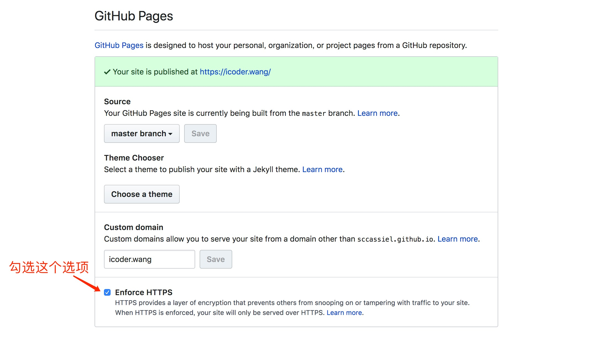
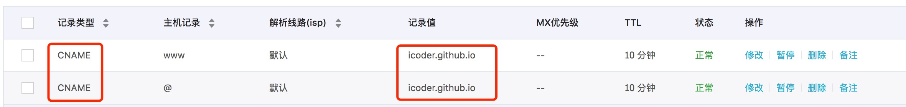

## <center>hexo博客搭建</center>
### hexo介绍

Hexo是一个快速、简洁且高效的博客框架。Hexo 使用 Markdown（或其他渲染引擎）解析文章，在几秒内，即可利用靓丽的主题生成静态网页-引用至官网，[传送门](https://hexo.io)

### hexo安装

安装hexo相当简单。然而在安装之前，你必须检查电脑中是否已经安装如下环境
   * [node.js](http://nodejs.org/)
   * [git](http://git-scm.com/)
如果你的电脑中还未安装，请自行[google](https://www.google.com),<font color="red">需要注意配置环境变量</font>。在以上环境安装完成之后,那么恭喜你，第一步成功了，接下来即可执行<code>npm install -g hexo-cli </code>，安装完成之后，开启你的博客之旅吧！具体hexo用法[详见](https://hexo.io/zh-cn/docs/setup)。

### hexo与GitHub Pages

在你将hexo run起来之后，是不是很想将你的文章分享给互联网上到其他人呢？如果是，那么恭喜你，你即将get到一项技能，将你的博客部署到GitHub Pages上，不必花钱买空间，省下的钱可以让你在买早饭到时候多加一个鸡蛋，嘻嘻！[GitHub Pages传送门](https://pages.github.com/)。OK，想必你已经懂了GitHub Pages上是什么东西了，那么接下来，hexo配合GitHub Pages怎么使用呢？
* 安装<code>npm install hexo-deployer-git --save<code>部署模块
* 在<code>_config.yml</code>文件中，找到Deployment,并做修改。我将我的配置贴出来，以供参考。
  ```javascript
  deploy:
    type: git
    repo: git@github.com:sccassiel/icoder.wang.github.io.git
    branch: master
  ```

### hexo ssl

是否想让自己的博客拥有绿色小锁？现在Github Pages已经支持ssl了，勾选Enforce HTTPS ，如下图所示。此时已经能支持https了，看看小锁是否绿了呢

### 自定义域名 

可以将以上Github Pages通过自定义域名访问，在此，我以阿里云域名为例，其他服务商类似，通过在<code>source</code>文件夹新建CNAME文件，文件内容为<code>icoder.wang</code>,因为我的域名是这个，这儿你设置成你的域名。然后在阿里云域名解析中，设置CNAME解析，如下图：
    

### gittalk评论插件

让博客充满活力，当然少不了评论功能，借助gittalk可以很轻量级的集成。[gittalk](https://gitalk.github.io/)官网地址。按照教程，可轻松集成。我贴一下我的配置吧
```javascript
   gitalk:
    autoExpand: false
    clientID: '3c47abf6bad0ba690501'
    clientSecret: 'd1bab30388e6386350500289ca42dc48fa7d6f0f'
    repo: 'icoder.wang.github.io'
    owner: 'sccassiel'
    admin: ['sccassiel']
    id: location.pathname
    distractionFreeMode: false
```
ok,自此，你已经拥有了一个比较完善的博客。如有高见，请通过评论告知我，一起交流，一起进步
